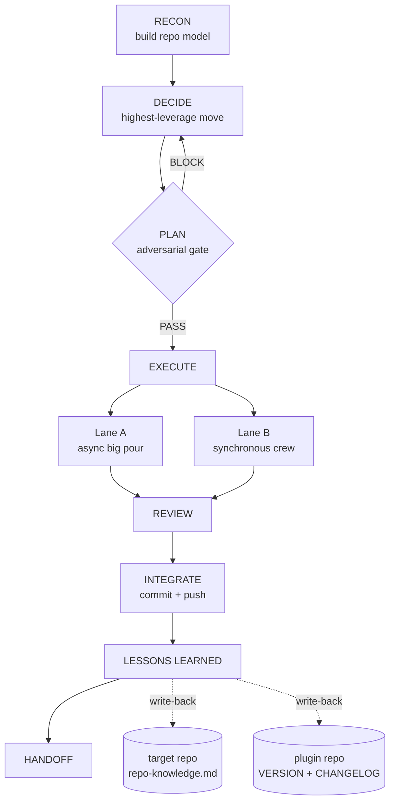

# SmokeJumper

A drop-in, autonomous product-development crew packaged as a standalone Claude Code plugin.

SmokeJumper lands cold in any repo, builds a model of what exists, decides the highest-leverage next move itself, executes via a mix of Claude agents and Codex, gates every push through an adversarial review, and runs a lessons-learned pass at the end — enriching both the target repo's own knowledge store and the plugin itself. Two things compound per deployment: the repo gets better, and the crew gets sharper.

---

## Install

### Latest (from GitHub)

```bash
claude plugin marketplace add https://github.com/shanemhamilton/smokejumper
claude plugin install smokejumper@smokejumper
```

### Local / pinned

```bash
claude plugin marketplace add ~/Documents/SmokeJumper
claude plugin install smokejumper@smokejumper-local
```

To validate before installing:

```bash
claude plugin validate ~/Documents/SmokeJumper
```

To cut a versioned release tag:

```bash
claude plugin tag ~/Documents/SmokeJumper
```

---

## Usage

```
/smokejumper
```

Starts a full sprint. SmokeJumper proceeds through all eight phases autonomously, pausing only for decisions that require product strategy, budget authority, or explicit release sign-off.

---

## The 8-phase lifecycle

Full design: [`docs/specs/2026-06-04-smokejumper-framework-design.md`](docs/specs/2026-06-04-smokejumper-framework-design.md)



1. **RECON** — Build a repo model: stack, conventions, gate locations, available tools, and any prior sprint knowledge from `.smokejumper/repo-knowledge.md`.
2. **DECIDE** — The detected leads choose the highest-leverage next move. No fixed pipeline; they assess the actual state of the product and pick.
3. **PLAN** *(front-loaded adversarial gate)* — Design + implementation plan produced, then put through the full adversarial review. PASS here authorizes execution — including any autonomous pour. Bad assumptions and unsafe decompositions are caught here, before hours of coding.
4. **EXECUTE** *(two lanes)*
   - **Lane A — big pour (async, hours→days):** For large, decomposable, non-safety-critical work. Spec converted into a bead molecule; Codex runs each child at `model_reasoning_effort=high` with per-child mechanical gates (tests, build, lint, coverage). Launched as `nohup ./ralph.sh &` loops that grind autonomously and survive context resets.
   - **Lane B — synchronous crew (in-session):** For novel, architectural, design-sensitive, or safety-critical units. Engineering Lead dispatches Claude + Codex directly through the full adversarial flow to merged+pushed.
5. **REVIEW** — Lane B gets full adversarial review before push. Lane A children have per-child mechanical gates baked into the formula; milestone spot-checks sample the autonomous batch.
6. **INTEGRATE** — Commit and push. Merging ≠ deploying; releases need explicit human greenlight.
7. **LESSONS LEARNED** *(dual write-back)* — Learnings flow into two places: (a) `<target>/.smokejumper/repo-knowledge.md` committed to the target repo; (b) if a portable improvement was found, a versioned commit to this plugin repo with a `CHANGELOG.md` entry.
8. **HANDOFF** — Clean handoff prompt so the next session resumes with zero lost context. When Lane A loops are still running, the handoff carries them explicitly.

---

## Portability contract

SmokeJumper hard-requires only: a git repo, the Claude Code runtime, and the bundled agents and skill. Everything else is detected and adapted to.

| Target condition | Behavior |
|---|---|
| Has project-specific leads | Adapter prefers them; bundled generics stand down |
| No project leads | Bundled `smokejumper-{engineering,product,design}-lead` run |
| `choo-choo-ralph` installed | Lane A (big pour) available |
| `choo-choo-ralph` absent | `choo-choo-ralph:install` offered; else Lane-B-only; gap logged |
| Issue tracker present (beads, etc.) | Used for durable state |
| No issue tracker | State lives in `<target>/.smokejumper/` only |
| Missing specialist agent | Self-heal: authored into `<target>/.claude/agents/` + gap logged |
| Has `CLAUDE.md` / `AGENTS.md` | RECON honors its rules as defaults (model floor, git discipline, gates) |

Any work unit marked safety-critical by the target repo's guardian convention is barred from Lane A regardless of how cleanly it decomposes.

---

## How it self-improves

Every sprint produces two write-backs:

**Per-repo (committed to the target):** RECON loads `.smokejumper/repo-knowledge.md` on arrival; LESSONS LEARNED enriches it on departure — accumulating stack facts, known traps, gate locations, what worked and what to avoid. This file is append-only in its history sections and survives every context reset.

**Framework (committed here):** When a sprint surfaces a portable improvement — a better recon heuristic, a lifecycle fix, a gap worth bundling into the plugin — the orchestrator makes a versioned commit to this repo: `VERSION` and `plugin.json` bumped per SemVer, a `CHANGELOG.md` entry naming the deployment. `claude plugin tag` cuts the release. One deployment, one version increment: the crew gets sharper every drop.

---

## Repo layout

```
.claude-plugin/
  plugin.json            # plugin manifest
  marketplace.json       # local marketplace entry (source: "./")
agents/
  smokejumper-engineering-lead.md
  smokejumper-product-lead.md
  smokejumper-design-lead.md
skills/smokejumper/
  SKILL.md               # 8-phase orchestrator (the /smokejumper entry point)
  references/            # adapter, recon, gated-pour, self-healing, schema, lessons-learned
  scripts/
    sj-init.sh           # scaffolds <target>/.smokejumper/ (idempotent)
docs/specs/              # design spec
CHANGELOG.md
VERSION
```

---

## Contributing

See [`CONTRIBUTING.md`](CONTRIBUTING.md) — validate with `claude plugin validate .`, bump
`VERSION` + `plugin.json` together per SemVer, and record changes in `CHANGELOG.md`.

## License

[MIT](LICENSE) © Shane Hamilton
