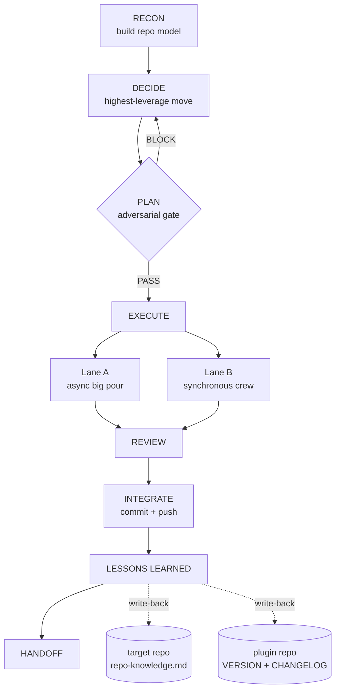

# SmokeJumper

A drop-in, autonomous product-development crew packaged as a standalone plugin for Claude Code and Codex.

SmokeJumper lands cold in any repo, builds a model of what exists, decides the highest-leverage next move itself, executes via a mix of Claude agents and Codex, gates every push through an adversarial review, and runs a lessons-learned pass at the end — enriching both the target repo's own knowledge store and the plugin itself. Two things compound per deployment: the repo gets better, and the crew gets sharper.

---

SmokeJumper installs from the **same plugin manifest** in both runtimes — Claude Code and
Codex share the `SKILL.md` + `agents/` + `.claude-plugin/marketplace.json` format.

### Claude Code

From GitHub:

```bash
claude plugin marketplace add https://github.com/shanemhamilton/smokejumper
claude plugin install smokejumper@smokejumper
```

Or from a local checkout (swap the marketplace source):

```bash
claude plugin marketplace add ~/Documents/SmokeJumper
claude plugin install smokejumper@smokejumper
```

### Codex

```bash
codex plugin marketplace add shanemhamilton/smokejumper
```

Then install the `smokejumper` plugin from within Codex (its `skill-installer` handles
enablement). For a local checkout, point the marketplace at the directory instead:

```bash
codex plugin marketplace add ~/Documents/SmokeJumper
```

### Validate / release (Claude Code)

Validate before installing:

```bash
claude plugin validate ~/Documents/SmokeJumper
```

Cut a versioned release tag:

```bash
claude plugin tag ~/Documents/SmokeJumper
```

---

## Usage

```
/smokejumper
```

Starts a full sprint. SmokeJumper proceeds through all eight phases autonomously, pausing only for decisions that require product strategy, budget authority, or explicit release sign-off.

---

## Running under a Codex (or non-Claude) orchestrator

SmokeJumper is built for Claude Code, but it also runs when a **Codex agent (or any
file-and-shell capable agent) is the top-level orchestrator** — point the agent at
`skills/smokejumper/SKILL.md` and have it follow the eight phases. A runtime preflight
(`references/runtime.md`) detects what your runtime can do and adapts:

- **No subagent dispatch** → leads and reviewers are *adopted inline*: the orchestrator reads the resolved `agents/*.md` persona and acts as that role for the phase. RECON runs `scripts/sj-adapter-scan.sh`, which resolves the leads, writes the mapping into `repo-knowledge.md`, and prints a **"Leads established" banner** — so lead establishment is a visible, durable artifact, not an implicit step.
- **No Skill tool** → the embedded reference files are used directly. Product context is bootstrapped by `references/product-context.md` + `templates/product-context.md` with **no dependency on any external skill**.
- **`anthropic-skills:handoff-prompt` unavailable** → Phase 8 writes `<target>/.smokejumper/HANDOFF.md` directly.
- **`choo-choo-ralph` / `bd` absent** → Lane A is unavailable; all work routes to Lane B (the synchronous crew).

---

## Lead establishment & product context

Two RECON outputs are durable, visible artifacts rather than steps an orchestrator has to remember — so they hold up under any runtime, including a Codex agent that skims prose.

**Leads are established by a deterministic scan, not from memory.** `scripts/sj-adapter-scan.sh` resolves the product / engineering / design leads (a project-specific override or the bundled fallback), the gate roles, and the available capabilities; writes the mapping into `<target>/.smokejumper/repo-knowledge.md`; emits a `leads_established` event to the sprint log; and prints a banner:

```
=== SmokeJumper — Leads Established ===
  Product lead:      smokejumper-product-lead   [BUNDLED]
  Engineering lead:  smokejumper-engineering-lead   [BUNDLED]
  Design lead:       smokejumper-design-lead   [BUNDLED]
  Gates resolved:    designReviewer=null thesisGuardian=null reviewIntegrity=null firstUseCritic=null qualityControl=null
  Capabilities:      asyncLoop=no codex=yes tracker=beads
  Product context:   MISSING — run Setup before DECIDE
=======================================
```

A lead is a **persona**, not a mandatory subagent: the orchestrator establishes it by reading its definition file and adopting it — or dispatching it, where the runtime supports that. Gate roles and safety/invariant guardians resolve from the **target** repo's `.claude/agents/` only — a foreign project's gate pulled from the global dir is misleading, and a foreign guardian is unsafe (absent must route safety-critical work to the human).

**Product context is bootstrapped, not inferred.** Before DECIDE, RECON establishes a compact PRODUCT_PILOT-style brief — phase, active milestone, blockers, metrics, differentiator:

- **Context mode** — a product-context layer already exists → read it as authoritative input to DECIDE.
- **Setup mode** — none exists (the brand-new-repo case) → a short discovery interview writes one to `docs/product/PRODUCT_PILOT.md`.
- **Update mode** — LESSONS LEARNED reflects shipped work back into it.

The bootstrap is fully self-contained (`references/product-context.md` + `templates/product-context.md`) with **no dependency on any external skill**, and it never fabricates: unknown metrics, competitors, and milestones are marked `[TODO]`, and an autonomous run with no human to interview stamps the artifact `unverified`.

---

## The 8-phase lifecycle

Full design: [`docs/specs/2026-06-04-smokejumper-framework-design.md`](docs/specs/2026-06-04-smokejumper-framework-design.md)



1. **RECON** — Build a repo model: stack, conventions, gate locations, available tools, and any prior sprint knowledge from `.smokejumper/repo-knowledge.md`. A deterministic adapter scan (`sj-adapter-scan.sh`) **establishes the leads** (visible banner + durable mapping), and a product-context bootstrap establishes a PRODUCT_PILOT-style brief — creating one on a brand-new repo where none exists.
2. **DECIDE** — The established leads choose the highest-leverage next move, reading the product-context artifact from RECON as authoritative. No fixed pipeline; they assess the actual state of the product and pick.
3. **PLAN** *(front-loaded adversarial gate)* — Design + implementation plan produced, then put through the full adversarial review. PASS here authorizes execution — including any autonomous pour. Bad assumptions and unsafe decompositions are caught here, before hours of coding.
4. **EXECUTE** *(two lanes)*
   - **Lane A — big pour (async, hours→days):** For large, decomposable, non-safety-critical work. Spec converted into a bead molecule; Codex runs each child at `model_reasoning_effort=high` with per-child mechanical gates (tests, build, lint, coverage). Launched as `nohup ./ralph.sh &` loops that grind autonomously and survive context resets.
   - **Lane B — synchronous crew (in-session):** For novel, architectural, design-sensitive, or safety-critical units. Engineering Lead dispatches Claude + Codex directly through the full adversarial flow to merged+pushed.
5. **REVIEW** — Lane B gets full adversarial review before push. Lane A children have per-child mechanical gates baked into the formula; milestone spot-checks sample the autonomous batch.
6. **INTEGRATE** — Commit and push. Merging ≠ deploying; releases need explicit human greenlight.
7. **LESSONS LEARNED** *(dual write-back)* — Learnings flow into two places: (a) `<target>/.smokejumper/repo-knowledge.md` committed to the target repo; (b) if a portable improvement was found, a versioned commit to this plugin repo with a `CHANGELOG.md` entry.
8. **HANDOFF** — Clean handoff prompt so the next session resumes with zero lost context. When Lane A loops are still running, the handoff carries them explicitly.

---

## Portability contract

SmokeJumper hard-requires only: a git repo, and the bundled agents, skill, and scripts. It runs best under the Claude Code runtime (subagent dispatch + skills) but degrades gracefully to inline persona adoption under any other orchestrator — including a Codex agent driving the sprint (see [Running under a Codex orchestrator](#running-under-a-codex-or-non-claude-orchestrator)). Everything else is detected and adapted to.

| Target condition | Behavior |
|---|---|
| Has project-specific leads | Adapter prefers them; bundled generics stand down |
| No project leads | Bundled `smokejumper-{engineering,product,design}-lead` run |
| Codex (or non-Claude) orchestrator | Inline-adoption mode — leads/reviewers adopted by reading their definition files; embedded references used directly |
| No product context layer | RECON bootstraps a PRODUCT_PILOT-style brief before DECIDE |
| Product context layer present | RECON reads it; LESSONS LEARNED updates it |
| `choo-choo-ralph` installed | Lane A (big pour) available |
| `choo-choo-ralph` absent | `choo-choo-ralph:install` offered; else Lane-B-only; gap logged |
| Issue tracker present (beads, etc.) | Used for durable state |
| No issue tracker | State lives in `<target>/.smokejumper/` only |
| Missing specialist agent | Self-heal: authored into `<target>/.claude/agents/` + gap logged |
| Has `CLAUDE.md` / `AGENTS.md` | RECON honors its rules as defaults (model floor, git discipline, gates) |

Any work unit marked safety-critical by the target repo's guardian convention is barred from Lane A regardless of how cleanly it decomposes.

---

## Dependencies

SmokeJumper is a thin orchestration layer — it composes other projects rather than
reimplementing them. The set is declared in `skills/smokejumper/references/dependencies.json`
(explained in `dependencies.md`), so it's explicit, trackable, and easy to extend.

| Dependency | Role | Status |
|---|---|---|
| [choo-choo-ralph](https://github.com/mj-meyer/choo-choo-ralph) | Lane A async "big pour" engine | optional backend |
| [metaswarm](https://github.com/dsifry/metaswarm) | optional adversarial-gate backend (cross-model gates, PR shepherd) | optional backend |
| [bugsweep](https://github.com/shanemhamilton/bugsweep) | optional deep bug-hunt (Hunter→Skeptic→Referee) in REVIEW | optional backend |
| [product-pilot](https://github.com/shanemhamilton/product-pilot) | product-context layer | **vendored** (embedded, re-synced from upstream) |
| [handoff-prompt-skill](https://github.com/shanemhamilton/handoff-prompt-skill) | Phase 8 handoff | optional (built-in fallback) |
| Beads (`bd`) · Codex CLI · `gh` | tracker / exec / tracker-fallback | optional, adapter-detected |

Only **git** and **one of** Claude Code or Codex are hard-required; every dependency above
degrades gracefully when absent (it never blocks a sprint).

**Staying current — pin → notify → opt-in (never silent auto-pull).** Each dependency carries
a tested `pin`. At sprint start, `scripts/sj-deps-check.sh` notifies (fail-silent,
time-boxed) when an upstream has moved past its pin; `sj-deps-check.sh --update` bumps the
pins on demand and prints the upgrade commands. A scheduled GitHub Action
(`.github/workflows/dependency-scan.yml`) runs the same check in this repo and opens an issue
when an upstream moves — so the plugin stays current without touching anyone's sprint.
**Adding a new dependency is one JSON entry** (`dependencies.md` documents the schema).

---

## How it self-improves

Every sprint produces two write-backs:

**Per-repo (committed to the target):** RECON loads `.smokejumper/repo-knowledge.md` on arrival; LESSONS LEARNED enriches it on departure — accumulating stack facts, known traps, gate locations, what worked and what to avoid. This file is append-only in its history sections and survives every context reset.

**Framework (committed here):** When a sprint surfaces a portable improvement — a better recon heuristic, a lifecycle fix, a gap worth bundling into the plugin — the orchestrator makes a versioned commit to this repo: `VERSION` and `plugin.json` bumped per SemVer, a `CHANGELOG.md` entry naming the deployment. `claude plugin tag` cuts the release. One deployment, one version increment: the crew gets sharper every drop.

---

## Repo layout

```
.claude-plugin/
  plugin.json            # plugin manifest
  marketplace.json       # local marketplace entry (source: "./")
agents/
  smokejumper-engineering-lead.md
  smokejumper-product-lead.md
  smokejumper-design-lead.md
skills/smokejumper/
  SKILL.md               # 8-phase orchestrator (the /smokejumper entry point)
  references/            # runtime, recon, adapter, product-context, dependencies, gated-pour, self-healing, schema, lessons-learned
  references/dependencies.json  # declared dependency manifest (single source of truth)
  agents/openai.yaml     # Codex skill-discovery metadata
  templates/
    product-context.md   # embedded PRODUCT_PILOT-style brief (no external skill needed)
  scripts/
    sj-init.sh           # scaffolds <target>/.smokejumper/ (idempotent)
    sj-adapter-scan.sh   # deterministic lead/gate/capability scan → mapping + banner + events
    sj-version-check.sh  # non-blocking SmokeJumper update check, run at sprint start
    sj-deps-check.sh     # non-blocking dependency drift check (--update to bump pins)
.github/workflows/
  dependency-scan.yml    # scheduled upstream-drift scan → opens an issue
docs/specs/              # design spec
CHANGELOG.md
VERSION
```

---

## Contributing

See [`CONTRIBUTING.md`](CONTRIBUTING.md) — validate with `claude plugin validate .`, bump
`VERSION` + `plugin.json` together per SemVer, and record changes in `CHANGELOG.md`.

## License

[MIT](LICENSE) © Shane Hamilton
